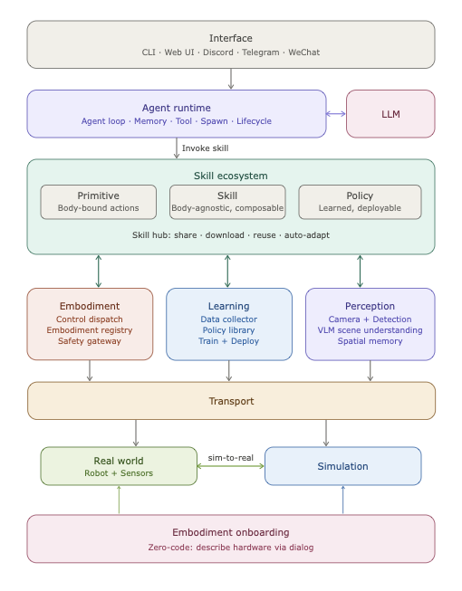

<h1>
  
  RoboClaw
</h1>

<p>
  
  
  
  
  <a href="https://discord.gg/HNcDbDYR"></a>
</p>

**RoboClaw** is an open-source embodied intelligence assistant.

## ✨ Architecture

<p align="center">
  
</p>

## 🎬 Demo

<table>
  <tr>
    <th width="75%"><p align="center">🖥️ CLI</p></th>
    <th width="25%"><p align="center">📱 Mobile</p></th>
  </tr>
  <tr>
    <td align="center">
      <video src="https://github.com/user-attachments/assets/3c5d08ad-96f5-4d34-94e1-b9cdfeec41d5" autoplay loop muted playsinline width="100%">
        <a href="https://github.com/user-attachments/assets/3c5d08ad-96f5-4d34-94e1-b9cdfeec41d5">View demo video</a>
      </video>
    </td>
    <td align="center">
      <br/><br/><br/>
      <b>Coming Soon</b>
      <br/><br/><br/><br/>
    </td>
  </tr>
</table>

## 📢 News

- **2026-03-24** Conversational arm setup, calibration, teleoperation, data collection, training, and inference.
- **2026-03-17** Embodied framework skeleton, domain contracts, and assembly-centered onboarding controller.
- **2026-03-12** Repository created.

## 📦 Installation

- `Preferred local workflow`:

```bash
uv venv
uv sync --extra dev
uv run roboclaw onboard
```

- `Embodied learning stack`:

```bash
uv sync --extra dev --extra learning
```

- `AI-assisted setup`: ask your coding assistant:

```text
Help me install RoboClaw from https://github.com/MINT-SJTU/RoboClaw
```

- [Non-Docker Installation](./docs/INSTALLATION.md)
- [Docker Installation](./docs/DOCKERINSTALLATION.md)

## 📢 Community Co-Creation

RoboClaw is being built in the open. We want major direction-setting choices, such as embodiment support, simulator priorities, and roadmap focus, to be discussed with the community.

You can contribute through:

- `Issues`: bug reports, feature requests, and implementation suggestions
- `Pull Requests`: code and documentation improvements

The most useful contribution areas right now are:

- embodied AI architecture
- capability abstraction and semantic skill interfaces
- ROS2 and execution-layer integration
- simulator support and real robot adaptation
- evaluation, validation, and developer experience

If you want to contribute more actively, contact us at bozhaonanjing [[@]] gmail [[DOT]] com.


## 🙏 Acknowledgments

RoboClaw references and inherits part of its initial thinking from [nanobot](https://github.com/HKUDS/nanobot). We appreciate its lightweight practice along the [OpenClaw](https://github.com/openclaw/openclaw) line, which helped us build the first prototype faster and continue evolving toward embodied intelligence.

## Community Channels

- Discord: [Join the server](https://discord.gg/HNcDbDYR)
- WeChat official post: [Coming Soon](https://evorl.example.com/wechat-post)
- GitHub Issues: [Create an issue](https://github.com/MINT-SJTU/RoboClaw/issues)
- Email: bozhaonanjing [[@]] gmail [[DOT]] com

## Affiliations

<p align="center">
  
  
</p>

## Citation

```bibtex
@misc{roboclaw2026,
  title        = {RoboClaw: An Open-Source Embodied Intelligence Assistant},
  author       = {RoboClaw Contributors},
  year         = {2026},
  howpublished = {\url{https://github.com/MINT-SJTU/RoboClaw}}
}
```
