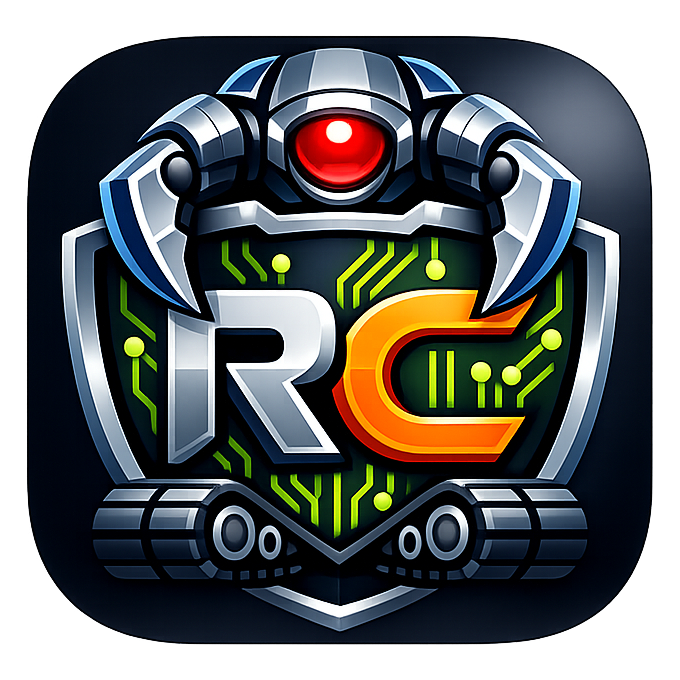

<h1>
  
  RoboClaw
</h1>

<p>
  
  
  
  
  <a href="https://discord.gg/HNcDbDYR"></a>
</p>

**RoboClaw** is an open-source embodied intelligence assistant.

## ✨ What We Want To Build

RoboClaw is being built around four planes:

- `General Embodied Entry Plane`: the user-facing path from natural language to a runnable embodied session
- `Embodiment Onboarding Pattern Plane`: the reusable pattern for bringing new open-source embodiments into RoboClaw without hard-coding one robot into the generic stack
- `Cross-Embodiment Skill Base Plane`: the shared semantic layer where multiple embodiments can expose compatible skills and procedures
- `Research Assistant Plane`: evaluation, failure analysis, recovery, and research workflows built on top of the embodied execution stack

Right now, we are concentrated on the first plane.

```text
Overall Data Flow

RoboClaw Agent
  ↓
Workspace / Catalog / Setup Resolution
  ↓
Procedure (connect / calibrate / move / debug / reset step graph)
  ↓
Runtime Adapter (active execution layer)
  ↓
Control Surface (interface profile + runtime server)
  ↓
Embodiment Runtime (hardware/sim-specific runtime)
  ↓
Real/Sim Embodiment
```

Current embodiment coverage is tracked like this:

| Category | Representative | Simulation | Real |
| --- | --- | --- | --- |
| Arm | SO101 | 🟡 | 🟡 |
| Dexterous Hand | Inspire | 🔴 | 🔴 |
| Humanoid | G1 | 🔴 | 🔴 |
| Wheeled Robot | WBase | 🔴 | 🔴 |

## 📦 Installation

### For Users

- `AI-assisted setup`: ask your coding assistant:

```text
Help me install RoboClaw from https://github.com/MINT-SJTU/RoboClaw
```

- [Non-Docker Installation](./INSTALLATION.md)
- [Docker Installation](./DOCKERINSTALLATION.md)

### For Developers

- [Docker Workflow](./DOCKER_WORKFLOW.md)

## 📢 Community Co-Creation

RoboClaw is being built in the open. We want major direction-setting choices, such as embodiment support, simulator priorities, and roadmap focus, to be discussed with the community.

You can contribute through:

- `Issues`: bug reports, feature requests, and implementation suggestions
- `Pull Requests`: code and documentation improvements

The most useful contribution areas right now are:

- embodied AI architecture
- capability abstraction and semantic skill interfaces
- ROS2 and execution-layer integration
- simulator support and real robot adaptation
- evaluation, validation, and developer experience

If you want to contribute more actively, contact us at bozhaonanjing [[@]] gmail [[DOT]] com.

## 🗺️ To-do List

- [x] Set up the open-source repository, publish the initial README, and add GitHub-native proposal entry points
- [x] Document the first embodied stack and its boundaries
- [ ] Define unified embodied capabilities and semantic interfaces
- [x] Run the first real setup end to end with workspace-generated assets
- [x] Support the first real robot platform
- [ ] Design safe-stop and recovery mechanisms
- [ ] Improve first-run reliability for embodied setup and execution
- [ ] Expand from the first supported embodiment to more open-source robots
- [ ] ...

Coming soon.

## 🙏 Acknowledgments

RoboClaw references and inherits part of its initial thinking from [nanobot](https://github.com/HKUDS/nanobot). We appreciate its lightweight practice along the [OpenClaw](https://github.com/openclaw/openclaw) line, which helped us build the first prototype faster and continue evolving toward embodied intelligence.

## Community Channels

- Discord: [Join the server](https://discord.gg/HNcDbDYR)
- WeChat official post: [Coming Soon](https://evorl.example.com/wechat-post)
- GitHub Issues: [Create an issue](https://github.com/MINT-SJTU/RoboClaw/issues)
- Email: business@evomind-tech.com

## Affiliations

<p align="center">
  
  
</p>

## Citation

```bibtex
@misc{roboclaw2026,
  title        = {RoboClaw: An Open-Source Embodied Intelligence Assistant},
  author       = {RoboClaw Contributors},
  year         = {2026},
  howpublished = {\url{https://github.com/MINT-SJTU/RoboClaw}}
}
```
